<!-- # Instructions and Expectations -->

<!-- - You are allowed and encouraged to work with two partners on this project.  Include your names, perm numbers, and whether you are taking the class for 131 or 231 credit. -->

<!-- - You are welcome to write up a project report in a research paper format -- abstract, introduction, methods, results, discussion -- as long as you address each of the prompts below.  Alternatively, you can use the assignment handout as a template and address each prompt in sequence, much as you would for a homework assignment. -->

<!-- - There should be no raw R _output_ in the body of your report!  All of your results should be formatted in a professional and visually appealing manner. That means that visualizations should be polished -- aesthetically clean, labeled clearly, and sized appropriately within the document you submit, tables should be nicely formatted (see `pander`, `xtable`, and `kable` packages). If you feel you must include raw R output, this should be included in an appendix, not the main body of the document you submit.   -->

<!-- - There should be no R _codes_ in the body of your report! Use the global chunk option `echo=FALSE` to exclude code from appearing in your document. If you feel it is important to include your codes, they can be put in an appendix. -->


# Background

The U.S. presidential election in 2012 did not come as a surprise. Some correctly predicted the outcome of the election correctly including [Nate Silver](https://en.wikipedia.org/wiki/Nate_Silver), 
and [many speculated about his approach](https://www.theguardian.com/science/grrlscientist/2012/nov/08/nate-sliver-predict-us-election).

Despite the success in 2012, the 2016 presidential election came as a 
[big surprise](https://fivethirtyeight.com/features/the-polls-missed-trump-we-asked-pollsters-why/) 
to many, and it underscored that predicting voter behavior is complicated for many reasons despite the tremendous effort in collecting, analyzing, and understanding many available datasets.

<!-- Your final project will be to merge census data with 2016 voting data to analyze the election outcome.  -->

<!-- To familiarize yourself with the general problem of predicting election outcomes, read the articles linked above and answer the following questions. Limit your responses to one paragraph for each. -->

1. What makes voter behavior prediction (and thus election forecasting) a hard problem?

$\rightarrow$ **Voter behavior prediction is a hard problem to model and predict because it involves human emotions including shame or guilt. Consequently, potential voters may lie or misrepresent their true vote when presented with the traditional polling methods. For context, this misclassification/ wrong prediction is not unexpected as a majority of U.S. presidential models have had poor accuracy in recent years; to acquire more accurate voter predictions and election forecasting results, one would have to improve on the traditional media polling methods involving modern survey methods through smartphones or websites.  **

2. What was unique to Nate Silver's approach in 2012 that allowed him to achieve good predictions?

$\rightarrow$ **Nate Silver's approach in 2012 had an accuracy rate of 100% - accurate predictions on voter behavior in every single state. To achieve such results, Silver employed a model involving Bayesion priors and selecting from a range of percentages; another way to describe it would be almost like a decision tree approach where you input previous known alongisde unknowns to arrive at percentages with different probabilities. I think that this spotlight on Silver's statistical model glosses over its inherent simplicity, and thus, intrepretebility; in such a technologically advanced world with these fancy models and computational methods, simplicity is sometimes refreshing.  **

3. What went wrong in 2016? What do you think should be done to make future predictions better?

$\rightarrow$ **In summary, there are numerous unique reasons which result in the error with classification models; in 2016 specifically, I would hypothesize that tremendous social pressure and social culture resulted in an over-fitted model due and a bias towards Clinton as the voter feelings were improperly assumed. To make future predictions better, I would advise pollers to consider the implementation of online anonymous polls or to look outside of the box and consider different people or to incorporate these variances into their statistical model rather than just basing their models off basic polling. **

# Data

The `project_data.RData` binary file contains three datasets: tract-level 2010 census data, stored as `census`; metadata `census_meta` with variable descriptions and types; and county-level vote tallies from the 2016 election, stored as `election_raw`.


## Election data

Some example rows of the election data are shown below:

----------------------------------------------------------------
       county         fips       candidate      state    votes  
-------------------- ------- ----------------- ------- ---------
 Los Angeles County   6037    Hillary Clinton    CA     2464364 

 Los Angeles County   6037     Donald Trump      CA     769743  

 Los Angeles County   6037     Gary Johnson      CA      88968  

 Los Angeles County   6037      Jill Stein       CA      76465  

 Los Angeles County   6037    Gloria La Riva     CA      21993  

    Cook County       17031   Hillary Clinton    IL     1611946 
----------------------------------------------------------------

The meaning of each column in `election_raw` is self-evident except `fips`. The accronym is short for [Federal Information Processing Standard](https://en.wikipedia.org/wiki/FIPS_county_code). In this dataset, `fips` values denote the area (nationwide, statewide, or countywide) that each row of data represent.

Nationwide and statewide tallies are included as rows in `election_raw` with `county` values of `NA`. There are two kinds of these summary rows:

* Federal-level summary rows have a `fips` value of `US`.
* State-level summary rows have the state name as the `fips` value.

4. Inspect rows with `fips=2000`. Provide a reason for excluding them. Drop these observations -- please write over `election_raw` -- and report the data dimensions after removal. 

$\bullet$ **We drop rows with "fips == 2000" because a fips value of 2000 has no corresponding county data - it is a null row. The dimensions of election_raw are 18345 rows by 5 columns after dropping these observations.**


```
## [1] 18345     5
```


## Census data

The first few rows and columns of the `census` data are shown below.

-----------------------------------------------------------
 CensusTract    State    County    TotalPop   Men    Women 
------------- --------- --------- ---------- ------ -------
 1001020100    Alabama   Autauga     1948     940    1008  

 1001020200    Alabama   Autauga     2156     1059   1097  

 1001020300    Alabama   Autauga     2968     1364   1604  

 1001020400    Alabama   Autauga     4423     2172   2251  

 1001020500    Alabama   Autauga    10763     4922   5841  

 1001020600    Alabama   Autauga     3851     1787   2064  
-----------------------------------------------------------
Variable descriptions are given in the `metadata` file. The variables shown above are:


-----------------------------------------------------
  variable             description            type   
------------- ----------------------------- ---------
 CensusTract         Census tract ID         numeric 

    State       State, DC, or Puerto Rico    string  

   County      County or county equivalent   string  

  TotalPop          Total population         numeric 

     Men              Number of men          numeric 

    Women            Number of women         numeric 
-----------------------------------------------------

\newpage
## Data preprocessing

5. Separate the rows of `election_raw` into separate federal-, state-, and county-level data frames:

    * Store federal-level tallies as `election_federal`.

    
    
    * Store state-level tallies as `election_state`.

    
    
    * Store county-level tallies as `election`. Coerce the `fips` variable to numeric.

    

6. How many named presidential candidates were there in the 2016 election? Draw a bar graph of all votes received by each candidate, and order the candidate names by decreasing vote counts. (You may need to log-transform the vote axis.)

```
## [1] 32
```

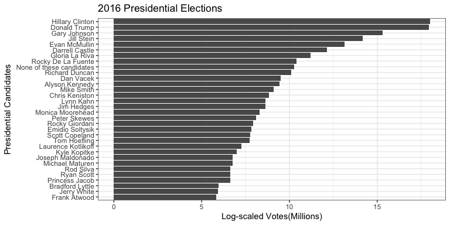

$\rightarrow$ **Using the count() and unique() functions, we know there are at least 31 named presidential candidates, and one column containing "None of these candidates" in the 2016 election. Each of these candidates are displayed alongside their log - transformed respective vote count in the bar graph above. **


7. Create variables `county_winner` and `state_winner` by taking the candidate with the highest proportion of votes. (Hint: to create `county_winner`, start with `election`, group by `fips`, compute `total` votes, and `pct = votes/total`. Then choose the highest row using `slice_max` (variable `state_winner` is similar).)


# Visualization

Here you'll generate maps of the election data using `ggmap`. The .Rmd file for this document contains codes to generate the following map.
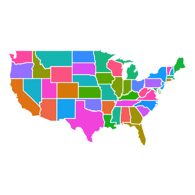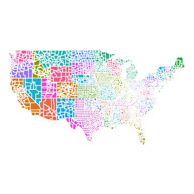

8. Draw a county-level map with `map_data("county")` and color by county.


In order to map the winning candidate for each state, the map data (`states`) must be merged with with the election data (`state_winner`).

The function `left_join()` will do the trick, but needs to join the data frames on a variable with values that match. In this case, that variable is the state name, but abbreviations are used in one data frame and the full name is used in the other.

9. Use the following function to create a `fips` variable in the `states` data frame with values that match the `fips` variable in `election_federal`.

```r
name2abb <- function(statename){
  ix <- match(statename, tolower(state.name))
  out <- state.abb[ix]
  return(out)}

#creating 'fips' variable in 'states' data-frame with requirements above & mutating it in 
states <- states %>% mutate(fips = name2abb(states$region))

#merging states and state_winner via left_join()
states_new <- left_join(states, state_winner)
```

```
## Joining, by = "fips"
```

Now the data frames can be merged. `left_join(df1, df2)` takes all the rows from `df1` and looks for matches in `df2`. For each match, `left_join()` appends the data from the second table to the matching row in the first; if no matching value is found, it adds missing values.

10. Use `left_join` to merge the tables and use the result to create a map of the election results by state. Your figure will look similar to this state level [New York Times map](https://www.nytimes.com/elections/results/president). (Hint: use `scale_fill_brewer(palette="Set1")` for a red-and-blue map.)
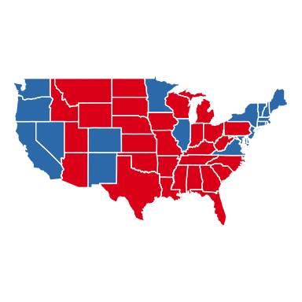


11. Now create a county-level map. The county-level map data does not have a `fips` value, so to create one, use information from `maps::county.fips`: split the `polyname` column to `region` and `subregion` using `tidyr::separate`, and use `left_join()` to combine `county.fips` with the county-level map data. Then construct the map. Your figure will look similar to county-level [New York Times map](https://www.nytimes.com/elections/results/president).

[Github](https://gitHub.com/AndrewM1130/2016-Election-Polling)

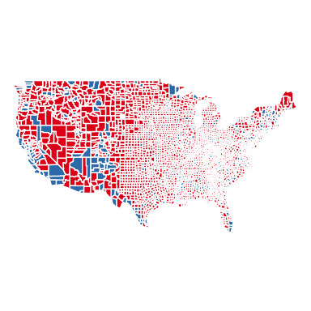

  
12. Create a visualization of your choice using `census` data. Many exit polls noted that [demographics played a big role in the election](https://fivethirtyeight.com/features/demographics-not-hacking-explain-the-election-results/). If you need a starting point, use [this Washington Post article](https://www.washingtonpost.com/graphics/politics/2016-election/exit-polls/) and [this R graph gallery](https://www.r-graph-gallery.com/) for ideas and inspiration.

$\bullet$ **With respect to the census data, I have decided to create a visualization exploring the relationship between poverty and political party affiliation. Notice from the graph that counties and states who voted Republican in 2016 suffers from higher levels of poverty when compared to counties who had voted majority Democratic. **


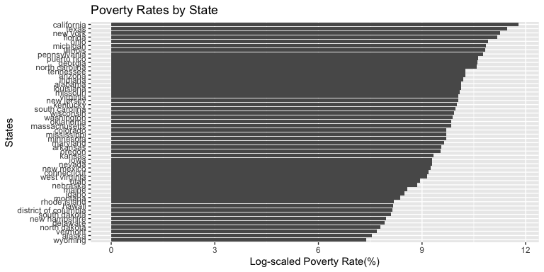

13. The `census` data contains high resolution information (more fine-grained than county-level). Aggregate the information into county-level data by computing population-weighted averages of each attribute for each county by carrying out the following steps:
    
* Clean census data, saving the result as `census_del`: 
  
   + filter out any rows of `census` with missing values;
   + convert `Men`, `Employed`, and `Citizen` to percentages;
   + compute a `Minority` variable by combining `Hispanic`, `Black`, `Native`, `Asian`, `Pacific`, and remove these variables after creating `Minority`; and
   + remove `Walk`, `PublicWork`, and `Construction`.


 
* Create population weights for sub-county census data, saving the result as `census_subct`: 
    + group `census_del` by `State` and `County`;
    + use `add_tally()` to compute `CountyPop`; 
    + compute the population weight as `TotalPop/CountyTotal`;
    + adjust all quantitative variables by multiplying by the population weights.

  
    
* Aggregate census data to county level, `census_ct`: group the sub-county data `census_subct` by state and county and compute population-weighted averages of each variable by taking the sum (since the variables were already transformed by the population weights)


    
* Print the first few rows and columns of `census_ct`. 
<div data-pagedtable="false">
  <script data-pagedtable-source type="application/json">
{"columns":[{"label":["State"],"name":[1],"type":["chr"],"align":["left"]},{"label":["County"],"name":[2],"type":["chr"],"align":["left"]},{"label":["CensusTract"],"name":[3],"type":["dbl"],"align":["right"]},{"label":["Men"],"name":[4],"type":["dbl"],"align":["right"]},{"label":["Women"],"name":[5],"type":["dbl"],"align":["right"]},{"label":["White"],"name":[6],"type":["dbl"],"align":["right"]},{"label":["Citizen"],"name":[7],"type":["dbl"],"align":["right"]},{"label":["Income"],"name":[8],"type":["dbl"],"align":["right"]},{"label":["IncomeErr"],"name":[9],"type":["dbl"],"align":["right"]},{"label":["IncomePerCap"],"name":[10],"type":["dbl"],"align":["right"]},{"label":["IncomePerCapErr"],"name":[11],"type":["dbl"],"align":["right"]},{"label":["Poverty"],"name":[12],"type":["dbl"],"align":["right"]},{"label":["ChildPoverty"],"name":[13],"type":["dbl"],"align":["right"]},{"label":["Professional"],"name":[14],"type":["dbl"],"align":["right"]},{"label":["Service"],"name":[15],"type":["dbl"],"align":["right"]},{"label":["Office"],"name":[16],"type":["dbl"],"align":["right"]},{"label":["Production"],"name":[17],"type":["dbl"],"align":["right"]},{"label":["Drive"],"name":[18],"type":["dbl"],"align":["right"]},{"label":["Carpool"],"name":[19],"type":["dbl"],"align":["right"]},{"label":["Transit"],"name":[20],"type":["dbl"],"align":["right"]},{"label":["OtherTransp"],"name":[21],"type":["dbl"],"align":["right"]},{"label":["WorkAtHome"],"name":[22],"type":["dbl"],"align":["right"]},{"label":["MeanCommute"],"name":[23],"type":["dbl"],"align":["right"]},{"label":["Employed"],"name":[24],"type":["dbl"],"align":["right"]},{"label":["PrivateWork"],"name":[25],"type":["dbl"],"align":["right"]},{"label":["SelfEmployed"],"name":[26],"type":["dbl"],"align":["right"]},{"label":["FamilyWork"],"name":[27],"type":["dbl"],"align":["right"]},{"label":["Unemployment"],"name":[28],"type":["dbl"],"align":["right"]},{"label":["Minority"],"name":[29],"type":["dbl"],"align":["right"]},{"label":["CountyPop"],"name":[30],"type":["dbl"],"align":["right"]},{"label":["PopWeight"],"name":[31],"type":["dbl"],"align":["right"]}],"data":[{"1":"Alabama","2":"Autauga","3":"12012247403","4":"48.43266","5":"51.56734","6":"75.78823","7":"73.74912","8":"51696.29","9":"7771.009","10":"24974.50","11":"3433.674","12":"12.91231","13":"18.70758","14":"32.79097","15":"17.17044","16":"24.28243","17":"17.15713","18":"87.50624","19":"8.781235","20":"0.09525905","21":"1.3059687","22":"1.8356531","23":"26.50016","24":"43.43637","25":"73.73649","26":"5.433254","27":"0.00000000","28":"7.733726","29":"22.53687","30":"55221","31":"0.11746263"},{"1":"Alabama","2":"Baldwin","3":"31093340873","4":"48.84866","5":"51.15134","6":"83.10262","7":"75.69406","8":"51074.36","9":"8745.050","10":"27316.84","11":"3803.718","12":"13.42423","13":"19.48431","14":"32.72994","15":"17.95092","16":"27.10439","17":"11.32186","18":"84.59861","19":"8.959078","20":"0.12662092","21":"1.4438000","22":"3.8504774","23":"26.32218","24":"44.05113","25":"81.28266","26":"5.909353","27":"0.36332686","28":"7.589820","29":"15.21426","30":"195121","31":"0.03945735"},{"1":"Alabama","2":"Barbour","3":"9053554500","4":"53.82816","5":"46.17184","6":"46.23159","7":"76.91222","8":"32959.30","9":"6031.065","10":"16824.22","11":"2430.189","12":"26.50563","13":"43.55962","14":"26.12404","15":"16.46343","16":"23.27878","17":"23.31741","18":"83.33021","19":"11.056609","20":"0.49540324","21":"1.6217251","22":"1.5019456","23":"24.51828","24":"31.92113","25":"71.59426","26":"7.149837","27":"0.08977425","28":"17.525557","29":"51.94382","30":"26932","31":"0.12346633"},{"1":"Alabama","2":"Bibb","3":"4028040010","4":"53.41090","5":"46.58910","6":"74.49989","7":"77.39781","8":"38886.63","9":"5662.358","10":"18430.99","11":"3073.599","12":"16.60375","13":"27.19708","14":"21.59010","15":"17.95545","16":"17.46731","17":"23.74415","18":"83.43488","19":"13.153641","20":"0.50313661","21":"1.5620952","22":"0.7314679","23":"28.71439","24":"36.69262","25":"76.74385","26":"6.637936","27":"0.39415148","28":"8.163104","29":"24.16597","30":"22604","31":"0.28228268"},{"1":"Alabama","2":"Blount","3":"9081453506","4":"49.40565","5":"50.59435","6":"87.85385","7":"73.37550","8":"46237.97","9":"8695.786","10":"20532.27","11":"2052.055","12":"16.72152","13":"26.85738","14":"28.52930","15":"13.94252","16":"23.83692","17":"20.10413","18":"84.85031","19":"11.279222","20":"0.36263213","21":"0.4199411","22":"2.2654133","23":"34.84489","24":"38.44914","25":"81.82671","26":"4.228716","27":"0.35649281","28":"7.699640","29":"10.59474","30":"57710","31":"0.12161797"},{"1":"Alabama","2":"Bullock","3":"3035856800","4":"53.00618","5":"46.99382","6":"22.19918","7":"75.45420","8":"33292.69","9":"9000.345","10":"17579.57","11":"3110.645","12":"24.50260","13":"37.29116","14":"19.55253","15":"14.92420","16":"20.17051","17":"25.73547","18":"74.77277","19":"14.839127","20":"0.77321596","21":"1.8238247","22":"3.0998783","23":"28.63106","24":"36.19592","25":"79.09065","26":"5.273684","27":"0.00000000","28":"17.890026","29":"76.53587","30":"10678","31":"0.39925182"}],"options":{"columns":{"min":{},"max":[10]},"rows":{"min":[10],"max":[10]},"pages":{}}}
  </script>
</div>


14. If you were physically located in the United States on election day for the 2016 presidential election, what state and county were you in? Compare and contrast the results and demographic information for this county with the state it is located in. If you were not in the United States on election day, select any county. Do you find anything unusual or surprising? If so, explain; if not, explain why not.
<div data-pagedtable="false">
  <script data-pagedtable-source type="application/json">
{"columns":[{"label":["State"],"name":[1],"type":["chr"],"align":["left"]},{"label":["County"],"name":[2],"type":["chr"],"align":["left"]},{"label":["Men"],"name":[3],"type":["dbl"],"align":["right"]},{"label":["Women"],"name":[4],"type":["dbl"],"align":["right"]},{"label":["White"],"name":[5],"type":["dbl"],"align":["right"]},{"label":["Citizen"],"name":[6],"type":["dbl"],"align":["right"]},{"label":["Income"],"name":[7],"type":["dbl"],"align":["right"]},{"label":["IncomeErr"],"name":[8],"type":["dbl"],"align":["right"]},{"label":["IncomePerCap"],"name":[9],"type":["dbl"],"align":["right"]},{"label":["IncomePerCapErr"],"name":[10],"type":["dbl"],"align":["right"]},{"label":["Poverty"],"name":[11],"type":["dbl"],"align":["right"]},{"label":["ChildPoverty"],"name":[12],"type":["dbl"],"align":["right"]},{"label":["Professional"],"name":[13],"type":["dbl"],"align":["right"]},{"label":["Service"],"name":[14],"type":["dbl"],"align":["right"]},{"label":["Office"],"name":[15],"type":["dbl"],"align":["right"]},{"label":["Production"],"name":[16],"type":["dbl"],"align":["right"]},{"label":["Drive"],"name":[17],"type":["dbl"],"align":["right"]},{"label":["Carpool"],"name":[18],"type":["dbl"],"align":["right"]},{"label":["Transit"],"name":[19],"type":["dbl"],"align":["right"]},{"label":["OtherTransp"],"name":[20],"type":["dbl"],"align":["right"]},{"label":["WorkAtHome"],"name":[21],"type":["dbl"],"align":["right"]},{"label":["MeanCommute"],"name":[22],"type":["dbl"],"align":["right"]},{"label":["Employed"],"name":[23],"type":["dbl"],"align":["right"]},{"label":["PrivateWork"],"name":[24],"type":["dbl"],"align":["right"]},{"label":["SelfEmployed"],"name":[25],"type":["dbl"],"align":["right"]},{"label":["FamilyWork"],"name":[26],"type":["dbl"],"align":["right"]},{"label":["Unemployment"],"name":[27],"type":["dbl"],"align":["right"]},{"label":["Minority"],"name":[28],"type":["dbl"],"align":["right"]},{"label":["CountyPop"],"name":[29],"type":["dbl"],"align":["right"]},{"label":["PopWeight"],"name":[30],"type":["dbl"],"align":["right"]}],"data":[{"1":"California","2":"Alameda","3":"49.00514","4":"50.99486","5":"32.97244","6":"64.73888","7":"83129.49","8":"12634.54","9":"37299.07","10":"4705.082","11":"12.71441","12":"14.69339","13":"45.46744","14":"16.63446","15":"21.61868","16":"9.567557","17":"64.32479","18":"10.11495","19":"13.21337","20":"3.318591","21":"5.388272","22":"30.62988","23":"49.10947","24":"78.84029","25":"7.353375","26":"0.1355598","27":"8.389265","28":"62.58824","29":"1583546","30":"0.003152197"}],"options":{"columns":{"min":{},"max":[10]},"rows":{"min":[10],"max":[10]},"pages":{}}}
  </script>
</div>


$\rightarrow$ **For the 2016 presidential election, I was living in the Alameda County of Berkeley, California - results for Alameda county were: 14.54% Republican & 78.06% Democratic. With respect to the demographics of Alameda county, our census_ct dataframe tell us that Alameda has an even split between genders, there are a number of unique circumstances. For example it is clear that Alameda County is largely inhabited by minorities as they are 62.5% of the total county population. Furthermore, ~35.5% of inhabitants are actually non-citizens, but poverty rates and income levels are not bad at 10% and ~80k/yr respectively. **

# Exploratory analysis

15. Carry out PCA for both county & sub-county level census data. Compute the first two principal components PC1 and PC2 for both county and sub-county respectively. Discuss whether you chose to center and scale the features and the reasons for your choice. Examine and interpret the loadings.

$\bullet$ **PCA involves the reduction of dimensions and the size of our dataset while attempting to retain most of our information; digging deeper into the fundamentals behind PCA reveals that centering is done inherently through the SVD() function due to its relationship with variance, and scaling is similar to the normalization of our data. Through the exploratory analysis of the census data above, I would hypothesize that features will need to be both scaled and centered due to the large range of numeric values present within the dataset. Without scaling, we might lose a lot of intrepretibility in the graphs, which is crucial in a project surrounding presidential elections. **

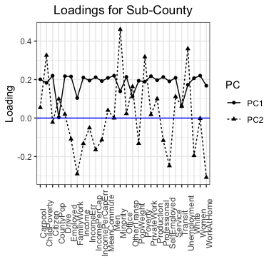

$\rightarrow$ **From PC1 and PC2, we can tell that ChildPoverty, Minority, and Unemployment features have the largest impact on the variance of our data; conversely, FamilyWork, SelfEmploted, and WorkAtHome had the least contribution. **

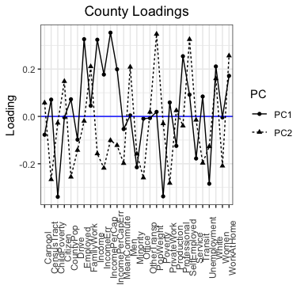

$\rightarrow$ **With respect to the first two principal components of the county data, it seems that Employment, Income, and Professional are the features with the largest absolute value, while Poverty and Unemployment played smaller roles in affecting total variance. **

16. Determine the minimum number of PCs needed to capture 90% of the variance for both the county and sub-county analyses. Plot the proportion of variance explained and cumulative variance explained for both county and sub-county analyses.
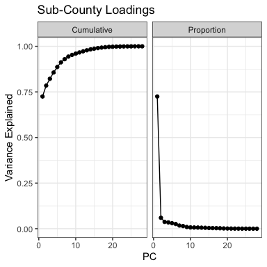

$\rightarrow$ **With respect to subcounty data, we would need ~15 principal components to capture 90% of the variance. **

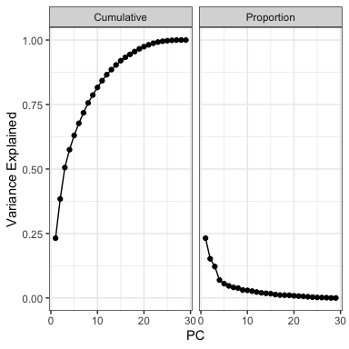

$\rightarrow$ **From the Variance vs. PC graph of County, ~17 principal components are needed to capture 90% of the variance. ** 


17. With `census_ct`, perform hierarchical clustering with complete linkage.  Cut the tree to partition the observations into 10 clusters. Re-run the hierarchical clustering algorithm using the first 5 principal components the county-level data as inputs instead of the original features. Compare and contrast the results. For both approaches investigate the cluster that contains San Mateo County. Which approach seemed to put San Mateo County in a more appropriate cluster? Comment on what you observe and discuss possible explanations for these observations.

```
## .
##  cluster 1  cluster 2  cluster 3  cluster 4  cluster 5  cluster 6  cluster 7 
##       1948       1141         80          8         16          1          8 
##  cluster 8  cluster 9 cluster 10 
##         10          2          4
```

```
## .
##  cluster 1  cluster 2  cluster 3  cluster 4  cluster 5  cluster 6  cluster 7 
##        891        684        152       1294         22          8         84 
##  cluster 8  cluster 9 cluster 10 
##         12          7         64
```


```
## [1] cluster 2
## 10 Levels: cluster 1 cluster 2 cluster 3 cluster 4 cluster 5 ... cluster 10
```


```
## [1] cluster 7
## 10 Levels: cluster 1 cluster 2 cluster 3 cluster 4 cluster 5 ... cluster 10
```

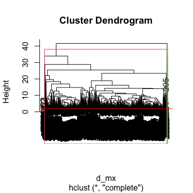

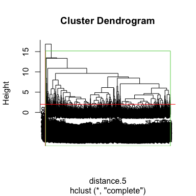


$\rightarrow$ **Above, we first applied the hierarchical clustering method 10 clusters on our census_ct observations, then again with the first five principal components as the data. After splitting into clusters, we examined cluster sizes and located the cluster containing the "San Mateo" county observation. Notice that both methods result in drastically different cluster sizes as well as different locations for our 'San Mateo' observation. Closer examination reveals that clisters built withcensus_ct contain many Caliofornia counties and seem to be grouped by location, while the clusters created off the first five principal components have no obvious conclusions. Using census_ct, with San Mateo County in cluster 2, is a more appropriate cluster than using the first five principal components, with San Mateo in cluster 7, because of the relative similarities it has to California county numbers in cluster 2. Possible explanations of this difference may include the fact that 5 principal components does not capture enough variance of the data and does not provide an accurate model.**

# Classification

In order to train classification models, we need to combine `county_winner` and `census_ct` data. This seemingly straightforward task is harder than it sounds. Codes are provided in the .Rmd file that make the necessary changes to merge them into `election_county` for classification.


After merging the data, partition the result into 80% training and 20% testing partitions.


18. Decision tree: train a decision tree on the training partition, and apply cost-complexity pruning. Visualize the tree before and after pruning. Estimate the misclassification errors on the test partition, and interpret and discuss the results of the decision tree analysis. Use your plot to tell a story about voting behavior in the US (see this [NYT infographic](https://archive.nytimes.com/www.nytimes.com/imagepages/2008/04/16/us/20080416_OBAMA_GRAPHIC.html)).


$\bullet$ **After closer analysis, we have determined that an alpha value of 13 will lead to the least amount of impurity within our pruned tree.**

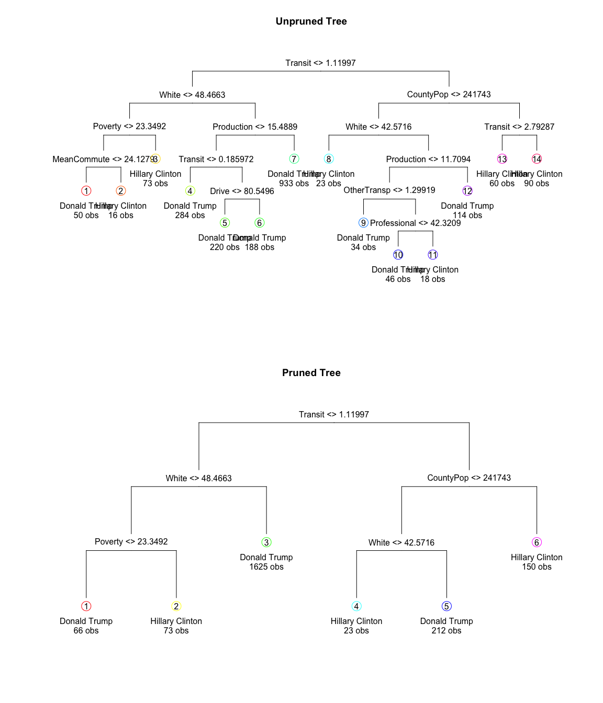


 $\rightarrow$ **It appears that the variables used to determine the tree are Transit, White, Unemployment, County Total,, Employed. White reappears within the tree indicating that it is an important factor that results in favorable results for Trump. Employment/Unemployment is another large factor that appears to trend towards more employed areas vote for Clinton over Trump.**
 
19. Train a logistic regression model on the training partition to predict the winning candidate in each county and estimate errors on the test partition. What are the significant variables? Are these consistent with what you observed in the decision tree analysis? Interpret the meaning of one or two significant coefficients of your choice in terms of a unit change in the variables. Did the results in your particular county (from question 14) match the predicted results?  

```
##                  y_hat_glm
## y                 Donald Trump Hillary Clinton
##   Donald Trump            1767              49
##   Hillary Clinton          102             231
```

$\rightarrow$ **From the misclassification table above, we conclude that the accuracy of our logistic regression model is pretty high with an accuracy rate of 0.9297348 on the test dataset, and with a relatively low false positive rate of 0.175. I believe that this high error rate arises from a lack of proper splitting techniques - maybe we should consider splitting via the caret() package or with replacement? When compared with Question 14, our model correctly predicted a "Clinton" classification for the candidacy response, which aligns with the actual 2016 electoral results in Alameda County. **


```
## 
## Call:
## glm(formula = candidate ~ ., family = "binomial", data = train)
## 
## Deviance Residuals: 
##     Min       1Q   Median       3Q      Max  
## -4.0515  -0.2630  -0.1102  -0.0342   4.0359  
## 
## Coefficients: (1 not defined because of singularities)
##                   Estimate Std. Error z value Pr(>|z|)    
## (Intercept)     -1.275e+00  9.753e+00  -0.131 0.896011    
## Men              5.448e-02  5.275e-02   1.033 0.301710    
## Women                   NA         NA      NA       NA    
## White           -1.846e-01  6.873e-02  -2.687 0.007220 ** 
## Citizen          1.206e-01  3.137e-02   3.844 0.000121 ***
## Income          -7.846e-05  2.854e-05  -2.749 0.005982 ** 
## IncomeErr       -6.231e-05  7.012e-05  -0.889 0.374208    
## IncomePerCap     2.682e-04  7.309e-05   3.669 0.000243 ***
## IncomePerCapErr -2.580e-04  2.019e-04  -1.278 0.201223    
## Poverty          1.100e-02  4.502e-02   0.244 0.806933    
## ChildPoverty    -2.393e-03  2.784e-02  -0.086 0.931501    
## Professional     1.961e-01  4.174e-02   4.698 2.63e-06 ***
## Service          2.763e-01  5.114e-02   5.402 6.60e-08 ***
## Office          -7.450e-03  5.280e-02  -0.141 0.887790    
## Production       1.329e-01  4.482e-02   2.965 0.003029 ** 
## Drive           -2.927e-01  5.051e-02  -5.795 6.82e-09 ***
## Carpool         -2.668e-01  6.681e-02  -3.994 6.50e-05 ***
## Transit         -3.457e-03  1.068e-01  -0.032 0.974168    
## OtherTransp     -1.478e-01  1.054e-01  -1.402 0.160773    
## WorkAtHome      -2.104e-01  7.949e-02  -2.647 0.008117 ** 
## MeanCommute      5.762e-02  2.626e-02   2.194 0.028203 *  
## Employed         1.713e-01  3.495e-02   4.901 9.54e-07 ***
## PrivateWork      6.486e-02  2.428e-02   2.672 0.007545 ** 
## SelfEmployed     1.813e-02  5.189e-02   0.349 0.726761    
## FamilyWork      -1.535e+00  4.849e-01  -3.165 0.001551 ** 
## Unemployment     1.611e-01  4.284e-02   3.760 0.000170 ***
## Minority        -4.793e-02  6.674e-02  -0.718 0.472684    
## CountyPop        1.362e-07  3.777e-07   0.360 0.718481    
## PopWeight       -2.951e+00  7.249e-01  -4.070 4.70e-05 ***
## ---
## Signif. codes:  0 '***' 0.001 '**' 0.01 '*' 0.05 '.' 0.1 ' ' 1
## 
## (Dispersion parameter for binomial family taken to be 1)
## 
##     Null deviance: 1853.34  on 2148  degrees of freedom
## Residual deviance:  759.12  on 2121  degrees of freedom
## AIC: 815.12
## 
## Number of Fisher Scoring iterations: 7
```

$\rightarrow$ **Furthermore, we would like to dive deeper into the predictor variables and their impact on our logistic regression model are those with low p-values such as Citizenship, Unemployment,  ; surprisingly, variables such as Driving, Carpooling, and Population density also have large effects on our response. Conversely, predictors such as transit type and self-employment had the lowest amount of impact and correlation on our response. Finally, one interpretation that can be made from the summary of our logistic regression is: For every one unit increase of poverty, the log odds of Donald Trump being the favored candidate increases by 0.011. **

20.  Compute ROC curves for the decision tree and logistic regression using predictions on the test data, and display them on the same plot. Based on your classification results, discuss the pros and cons of each method. Are the different classifiers more appropriate for answering different kinds of questions about the election?

```
## Setting levels: control = Donald Trump, case = Hillary Clinton
```

```
## Setting direction: controls < cases
```

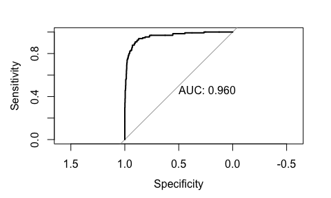

```
## The logistic model has an AUC score of 0.9597836 . A good model will have a high AUC, that is as often as possible a high sensitivity and specificity.
```

$\rightarrow$ **After fitting the census data onto both the decision tree and logistic regression model, I would conclude that logistic regression seems to be a better model than the pruned tree as our logistic regression curve has a larger area. However, we must remember that the benefits of the decision tree model lies in its inherent simplicity and intrepretability. When it comes to election and polling data, who is the audience? How important is accuracy and is ~5-10% accuracy a fair price to pay for intrepretibility? These are all unique questions relevant to the statistician or company itself and why no model is perfect! To find the "best -fitting" model, one needs to consider a tremendous number of factors: both within the dataset and in the context of the project.  **

# Taking it further

21. This is an open question. Interpret and discuss any overall insights gained in this analysis and possible explanations. Use any tools at your disposal to make your case: visualize errors on the map, discuss what does or doesn't seem reasonable based on your understanding of these methods, propose possible directions (for example, collecting additional data or domain knowledge).  In addition, propose and tackle _at least_ one more interesting question. Creative and thoughtful analyses will be rewarded! 

<!-- Some possibilities for further exploration are: -->

<!--   * Data preprocessing: we aggregated sub-county level data before performing classification. Would classification at the sub-county level before determining the winner perform better? What implicit assumptions are we making? -->

<!--   * Exploring one or more additional classification methods: KNN, LDA, QDA, random forest, boosting, neural networks. (You may research and use methods beyond those covered in this course). How do these compare to logistic regression and the tree method? -->

<!--   * Use linear regression models to predict the `total` vote for each candidate by county.  Compare and contrast these results with the classification models.  Which do you prefer and why?  How might they complement one another? -->

<!--   * Conduct an exploratory analysis of the "purple" counties-- the counties which the models predict Clinton and Trump were roughly equally likely to win.  What is it about these counties that make them hard to predict? -->

<!--   * Instead of using the native attributes (the original features), we can use principal components to create new (and lower dimensional) sets of features with which to train a classification model. This sometimes improves classification performance.  Compare classifiers trained on the original features with those trained on PCA features.   -->

$\rightarrow$ **Throughout this project, we have explored and applied numerous supervised and unsupervised methods on 2016 election & census data. Finishing this project showed me that the process behind electoral predictions is fairly complicated- I'm sure that industry deployed models have a tremendous amount of predictors. Furthermore, our analysis confirms common ideas surrounding political affiliation - predictors relevant to poverty levels, income, and percentage minority contribute a large amount to the county and sub-county predictions. Conversely, unexpected predictors such as are shown to have great impact in our logistic regression model.**

**Although this data was already very "clean" and relatively easy to work with, there were still small struggles throughout the project. Specifically, I found that the imported census and election datasets have misnamed column names, or . Thankfully, these issues were easily solved via utilizing the "tolower", "toupper" and "colnames" functions. **

**Analyzing past statistics is great, but how can we continue this project and what are its implications for future presidential polling issues? I would argue that we could incorporate more information out of this model surrounding the political affiliations between men and women, minorities & whites, e.t.c. Furthermore, one could explore connections between election results and unique variables such as commuting times and workplace location factors.**
  
$\bullet$ **In terms of taking it further, I will be running applying a KNN model with 8-fold cross validation on the election_county the and comparing the errors of the tree, logistic regression, and KNN methods to have a better idea of the pros and cons between different learning models.**


$\bullet$ **Above, we trained out election_county dataframe with the KNN method, utilizing cross-fold validation to find the optimal k - value, and then retraining our KNN model with that best k-value. Our KNN error table is shown below:**


```
## # A tibble: 2 × 1
## # Groups:   pred_knn [2]
##   pred_knn
##      <dbl>
## 1        1
## 2        2
```


```
##                  y_hat_knn
## y                 Donald Trump Hillary Clinton
##   Donald Trump            1770              46
##   Hillary Clinton          189             144
```

$\rightarrow$ **With an accuracy rate of and false positive rate of on the test data, the KNN method seems to be lack performance when compared to the logistic regression model with its lower accuracy rate of 0.89 and higher false positive rate of 0.24. It seems that our intuition and our choice of models above was correct!**


